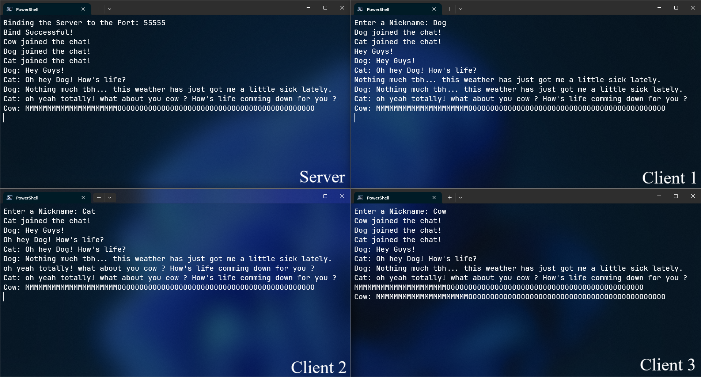

# Terminal based Python Chat Room Built over TCP --- v1


## ToDo
### 1. Add Colors to username inside the chat room using [Colorama](https://github.com/tartley/colorama):
```md
Dog: Hey Guys!<br>
^         ^<br>
GREEN    WHITE
```

Error messages should be RED and LIGHT_RED

### 2. Create simple Login Signup page for clients:
store the data permanently (maybe some sql?) for their future signons.

### 3. Create Admin privilege and Add chatroom commands for admins like:
* \kick : Kicks the exisiting user out of the room. <br>
* \Ban : Bans the existing username-password set from the room. <br>
* \Info : show basic info about the other user like their username so as to mute them if needed.<br>
* \Mute : Mutes a particular person (identified by their usernames) <br>

Admins should also have a (Adm) tag after their names so as to let others know.<br>
```md
Dog(Adm): Hey Guys!<br>
^RED ^YELLOW???  ^WHITE
```

### 4. Add Joining Welcome Message:
* For no priviliges explain them to be civil and bla bla bla ... and for admin (privileged), also explain the 
* The first person in a live chat room by default will be the admin
* once the current admin leaves, the next person in the queue (that is the next person who joined after the first user gets the admin privileges) and so on.
* Changes in admins should be announced. If no one is admin you becoming the admin should be announced.
* can admins make other people admins ?

* SERVER WILL ALSO HAVE THE ADMIN PRIVILEGES

### 5. Add time and date of sent messages on the other side of the messages
```md
Dog: Hey Guys!									12:46 AM | 20.12.24
                                                    			^GREYED
```
### Configure the whole thing into a CLI inspired from [whatscli](https://github.com/normen/whatscli)

<!--EOF-->